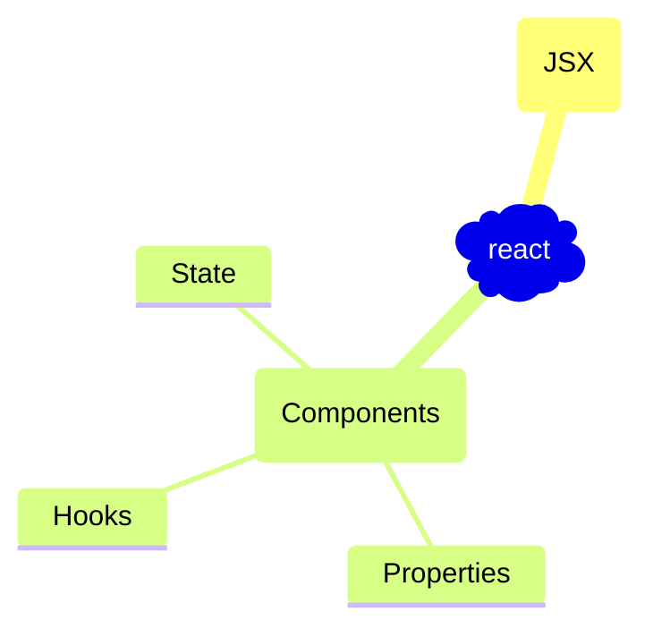
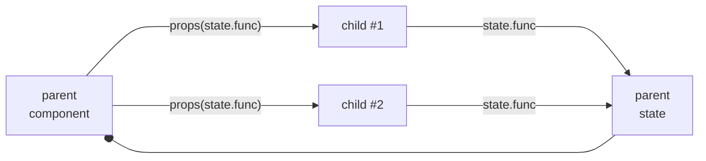

# ReactJS
## Code Examples
* [udemy react projects/examples](https://github.com/academind/react-complete-guide-course-resources/)

## Map


## JSX
  * [jsx rules](https://react.dev/learn/writing-markup-with-jsx)
    * Return a single root element ( or <> </>)
    * Close all the tags
    * camelCase all most of the things! 
  * [html-to-jsx converter](https://transform.tools/html-to-jsx)
  * files must have `.jsx` suffix ( extension ), 
    start with capital letter

## Components
### Rules:
 * function must start with UpperCase ( start with lowercase char - regular html element )
 * function must return renderable value ( JSX )
 * function/component way of creation  
  


### component example
```js
function MyComponent(){
    return <> <div>hello</div> </>
}
export function MyCompositeComponent(){
    return (<div> <MyComponent /> </div>)
}
// if no `export function` previously, then
// export default MyCompositeComponent
```
```js
// ! import Component from 'react';
import React, { Component } from 'react';
export class MainGoal extends Component {
    render(){    
        // return <div id='my_div_id'><p>my text</p></div>
        // create HTML element manually
        return React.createElement('div', {id: 'my_div_id'}, React.createElement('p', null, 'my text'))
    }
}
```

### component create 
#### component create via npx
```sh
# npm install --save-dev create-react-component-folder
COMPONENT_NAME=MyComponent
npx crcf $COMPONENT_NAME
```
### Resources ( img, css)
```js
import myImg from './assets/img/1.jpg'
function TableHeader(){
    // post-compiled-generated `src` property will be included 
    // no "" or '' should be added 
    // <Fragment> with new notation <>
    return <>  </>
}
```
### Properties
> parameters for component, put data into component
```jsx
function TableHeader(props){
    return <> hello {props.name} {props.title} </>
}
function TableHeader({name, title="default_title"}){
    return <> hello {name} {title} </>
}
function Table(){
    const userData={name: "Egor", title="Pilot"}
    return <>
        <TableHeader name="Valerian" title="Gameboy" />
        <TableHeader  {...userData} />
        <TableHeader2 {...userData} />
    </>
}
```
### State
```javascript
import { useState } from 'react';
// import React from 'react';

function MyComponent(){    
    // `setValue` is not updating `value` immediatelly,
    // value will be updated after the whole component arefresh
    // `setValue` has ability to receive parameters:
    // 1. direct value `value`
    // 2.     function 'oldValue=>newValue'
    //                for Objects: const deepCopy = JSON.parse(JSON.stringify(originalObject));
    const [value, setValue]=useState(initValue); // React.useState(); - component field ( ReactJS evaluates stack of the execution)
    
    return { <div> value </div> }
}
```
<b> if your state based on previous value,</b>  
<i>Due to scheduled updates</i>: use `setValue(value=>!value)` instead of `setValue(!value)`  
<i>for reproducing</i>: just duplicate `setValue(!value);setValue(!value);`

also useful for the conditional output
```javascript
function App(){
    return (<>
    { isDefinedValue && <b>Value is defined</b>} 
    {!isDefinedValue && <i>undefined Value </i>} 
    </>);
}
```
```javascript
function App(){
    if (true){
        returnValue = <div>{someValue}</div>
    } else {
        returnValue = <span>no data</span>
    }
    return returnValue;
}
```

#### Lifting State up


### Hooks ( starts with 'use...')
rules of hooks:
1. should be called inside the component
2. not inside the nested function

## [create react app](https://create-react-app.dev/docs/adding-typescript/)
```sh
APP_NAME=my_app_name
# use nvm for another version of node
npx create-react-app $APP_NAME

# https://www.npmjs.com/package/cra-template-typescript
npx create-react-app $APP_NAME --template typescript
npx create-react-app $APP_NAME --template cra-template-typescript.

cd $APP_NAME
# `npm install` has already been executed by npx 
npm start # `npm run start` - package.json#scripts
```
[alternative: build tool with optimization](https://vitejs.dev/guide/)
```sh
APP_NAME=my_app_name
npm create vite@latest $APP_NAME -- --template react
npm create vite@latest $APP_NAME -- --template react-ts

npm install
npm run dev
```


## style pseudo selector
```js
// npm install --save radium

import Radium from 'radium';
style={
   ':hover': {
   	backgroundColor:"red"
   },
   '@media (min-witdh: 480px)':{
   	width: "350px"
   }
}

export default Radium(MyComponent);

// for media - wrap root component with:
// import { StyleRoot } from 'radium';
// <StyleRoot> </StyleRoot>
```.


### import alias
```js
import { Location as LocationModel } from 'src/app/core/models/location.model';
```